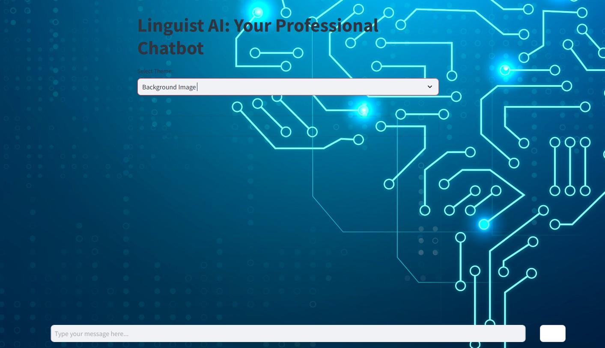

# Professional Chatbot Using LLaMA Model



## Project Overview

This project focuses on building a highly interactive and professional chatbot using the **LLaMA (Large Language Model Meta AI)** model via an API. The chatbot is designed to simulate natural conversations with users, providing coherent and contextually relevant responses. The chatbot interface is developed using **Streamlit**, a powerful web framework that allows for rapid UI development, while the model API is integrated to handle the natural language processing tasks.

The repository contains all the necessary files to set up the chatbot, including the Python script (`app.py`), images for customization, and a `requirements.txt` file detailing the dependencies.

---

## Features

- **LLaMA Model Integration**: The chatbot utilizes the LLaMA model from Hugging Face via API, making it capable of delivering accurate and context-aware responses.
- **Streamlit-Based UI**: A dynamic and intuitive user interface built using Streamlit ensures that the chatbot interactions are smooth and engaging.
- **CSS Customization**: The chatbot interface incorporates custom themes, CSS, and HTML for an attractive and professional look.
- **Static Input Box & Send Button**: The input box and send button are fixed at the bottom of the screen, offering a seamless user experience while the chat scrolls dynamically above.
- **Enhanced Responsiveness**: The chatbot UI is designed to be responsive, making it accessible across different screen sizes and devices.

---

## Files Included

- **app.py**: This is the main script that initializes the chatbot interface using Streamlit and integrates the LLaMA model for conversation processing.
- **requirements.txt**: Contains the list of dependencies, including `streamlit`, `requests`, and other necessary libraries to ensure smooth setup and functioning of the app.
- **README.md**: Documentation for the project, explaining setup instructions, usage, and feature highlights.
- **Images**: 
  - `Glows.jpeg`, `lion.jpeg`, and other images are included to provide a visually appealing background and layout for the chatbot interface.
  - These images add aesthetic value, making the interface look modern and user-friendly.

---

## Key Components

1. **Chatbot Logic**:
   - The core of the chatbot is powered by the LLaMA model, which handles all user queries and generates responses based on context.
   
2. **Streamlit Interface**:
   - The frontend is built using Streamlit, providing an interactive, real-time web application.
   - CSS and HTML modifications are applied for a sleek, professional look.

3. **User Experience (UX)**:
   - The input box is always fixed at the bottom of the page, allowing the user to submit queries without scrolling, even as chat history grows.
   - The chat history is displayed in a scrollable container above the input area, allowing users to review past conversations easily.

---

## Setup Instructions

1. Clone the repository to your local machine:
   ```bash
   git clone https://github.com/abdullahzunorain/Professional_Chatbot_Using_LLaMA_model.git
   ```

2. Navigate to the project directory:
   ```bash
   cd Professional_Chatbot_Using_LLaMA_model
   ```

3. Install the required dependencies:
   ```bash
   pip install -r requirements.txt
   ```

4. Run the Streamlit app:
   ```bash
   streamlit run app.py
   ```

5. The chatbot should now be accessible at `http://localhost:8501`, where users can interact with it.

---

## Potential Use Cases

- **Customer Support**: Can be used as a virtual assistant for handling queries from customers in an automated manner.
- **Educational Tools**: Serve as an interactive learning assistant for students or researchers.
- **Entertainment**: Create a fun, engaging chatbot for casual conversations or specific roles (e.g., a story-teller bot).

---

## Future Enhancements

- **Multilingual Support**: Expanding the chatbot to support multiple languages.
- **Additional Customization**: Further customization of the UI with advanced CSS and animations.
- **Fine-tuning LLaMA**: Fine-tuning the chatbot's response generation based on user feedback for improved conversation quality.

---

## Conclusion

This project showcases a professional and well-designed chatbot with a robust backend powered by the LLaMA model. The use of Streamlit ensures a user-friendly interface, while the integration of custom styles enhances the overall look and feel of the chatbot. Whether used for customer service, educational assistance, or personal entertainment, this chatbot serves as a practical and scalable solution for natural language interaction.

